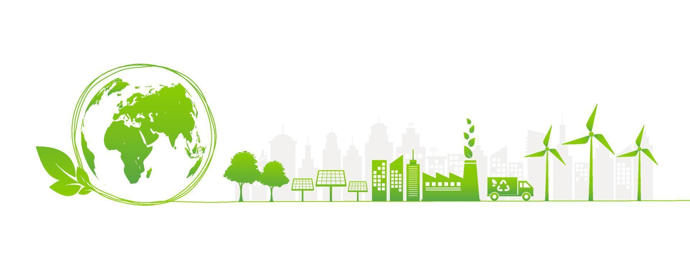
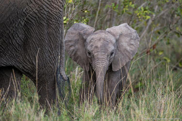
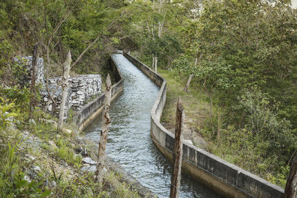
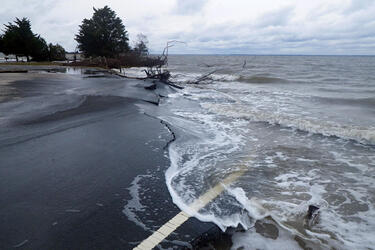

<!DOCTYPE html>
<head>
    <meta charset="UTF-8">
    <meta name="viewport" content="width=device-width, initial-scale=1.0">
    <title>Websites about Protected Areas Issues</title>
    
</head>
<body>

    <!--Banner-->  
    
    <h3 style="position: relative;font-family:verdana, sans-serif;font-size:36px;font-weight:bold;text-align:center;letter-spacing:1px;margin:0;padding: 0;color:#BEBEBE;line-height:110%;">Websites about Protected Areas Issues</h3>

    <!--Introduction Area-->
    

        Protected areas, such as national parks, wildlife reserves, and marine sanctuaries, are essential for preserving the planet’s rich biodiversity and ensuring the survival of countless species. These areas serve as havens for flora and fauna, offering protection from the harmful effects of deforestation, industrial development, and climate change. However, the increasing demands of human activities, including agriculture, mining, and urban expansion, have placed immense pressure on these fragile ecosystems. The encroachment on protected lands not only threatens endangered species but also disrupts natural processes that sustain the earth’s ecological balance.
    

    

In today's world, safeguarding these areas has become more critical than ever. Understanding the challenges they face—such as illegal poaching, pollution, and habitat destruction—is the first step toward effective conservation. Equally important are the strategies designed to combat these issues, from enforcing stronger legal protections to promoting sustainable tourism. By raising awareness and taking collective action, we can ensure that these protected areas continue to thrive and serve as vital sanctuaries for future generations.
    

    
 Below are some links to websites related to this issue:

    <!--6 hyperlinks, bulleted-->
    <ul style="font-family:verdana, sans-serif;text-align: center;font-size:15px;list-style-type: none;">
        <li>&#9733; <a href="https://www.worldwildlife.org" target="_blank">World Wildlife Fund (WWF)</a></li>
        <li>&#9733; <a href="https://www.iucn.org" target="_blank">International Union for Conservation of Nature (IUCN)</a></li>
        <li>&#9733; <a href="https://www.unep.org" target="_blank">United Nations Environment Programme (UNEP)</a></li>
        <li>&#9733; <a href="https://www.nature.org" target="_blank">The Nature Conservancy</a></li>
        <li>&#9733; <a href="https://www.protectedplanet.net" target="_blank">Protected Planet (by UNEP-WCMC and IUCN)</a></li>
        <li>&#9733; <a href="https://www.nationalgeographic.com/environment" target="_blank">National Geographic: Environment</a></li>
    </ul>

    <!--images-->
    

        
        
        
    

    
Images from https://www.worldwildlife.org/

    <!--Footer-->
    <footer>
    

    
&copy; Brianna Dionisio - 301468985

    
Assignment 2 - Protected Areas Issues

    
Information and image credits: WWF, IUCN, UNEP, The nature Conservancy, Protected Planet, National Geographic, Vecteezy.

    </footer>
